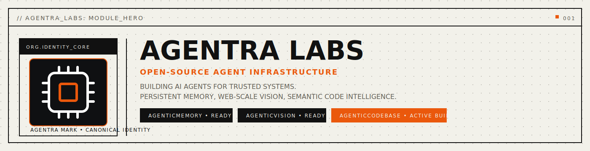

  

  <strong>Open infrastructure for reliable, long-lived AI agents.</strong> 
  Agentra Labs develops open, modular infrastructure for AI agents that need continuity, control, and trust. We focus on persistent state, structured reasoning surfaces, and policy-enforced execution with audit-ready run trails.

  <a href="https://agentralabs.tech">Website</a> ·
  <a href="https://github.com/agentralabs/agentic-memory">AgenticMemory</a> ·
  <a href="https://github.com/agentralabs/agentic-vision">AgenticVision</a> ·
  <a href="https://github.com/agentralabs/agentic-codebase">AgenticCodebase</a> ·
  <a href="https://github.com/agentralabs/agentic-identity">AgenticIdentity</a>

---

## Mission

Agentra Labs develops open, modular infrastructure for AI agents that need continuity, control, and trust. We focus on persistent state, structured reasoning surfaces, and policy-enforced execution with audit-ready run trails.  
We focus on systems where agents **remember**, **see**, **understand**, and **prove** with continuity across sessions and environments.

  

## Goals

- Deliver persistent cognition through graph memory (`.amem`).
- Deliver browserless web cartography and action surfaces (`.avis`).
- Deliver semantic code intelligence and impact-aware automation (`.acb`).
- Deliver cryptographic agent identity with signed receipts and scoped trust (`.aid`).
- Keep every sister standalone-first while enabling optional ecosystem integration.

## Ecosystem

  

## Collaborate

We are open to:

- research collaborations
- OSS contributors and maintainers
- ecosystem integrations (MCP, desktop agents, infra)
- sponsorship and institutional partnerships

Contact: [hello@agentralabs.tech](mailto:hello@agentralabs.tech)

---

  Built by <strong>Agentra Labs</strong>

