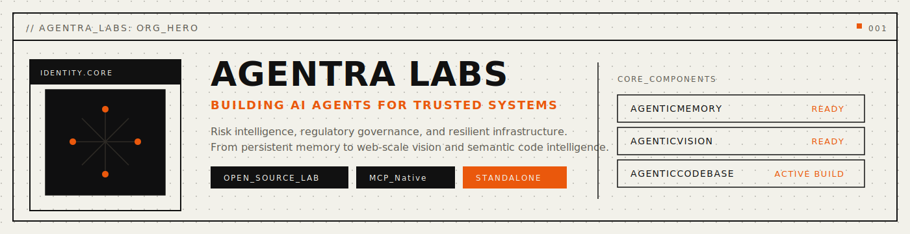
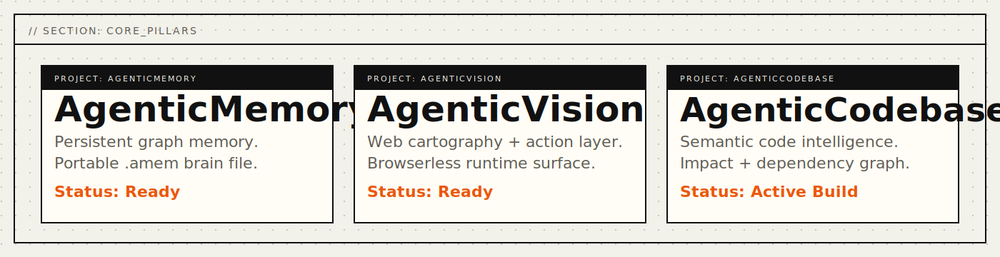
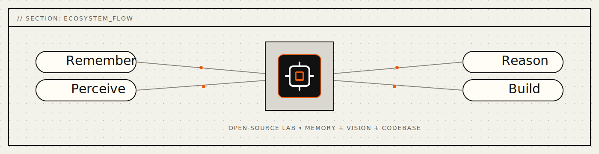

  

  <strong>BUILDING AI AGENTS FOR TRUSTED SYSTEMS</strong> 
  Risk intelligence, regulatory governance, and resilient infrastructure. 
  From persistent memory to web-scale vision and semantic code intelligence.

  <a href="https://agentralabs.tech">Website</a> ·
  <a href="https://github.com/agentralabs/agentic-memory">AgenticMemory</a> ·
  <a href="https://github.com/agentralabs/agentic-vision">AgenticVision</a> ·
  <a href="https://github.com/agentralabs/agentic-codebase">AgenticCodebase</a>

---

## Mission

Agentra Labs is an open-source lab building agent infrastructure that is durable, inspectable, and portable across tools.  
We are building systems where agents can **remember**, **see**, and **understand** with continuity across sessions and environments.

  

## Goals

- Deliver persistent cognition through graph memory (`.amem`).
- Deliver browserless web cartography and action surfaces (`.avis`).
- Deliver semantic code intelligence and impact-aware automation (`.acb`).
- Keep every sister standalone-first while enabling optional ecosystem integration.

## Ecosystem

  

- **AgenticMemory**: persistent graph memory in portable `.amem` files.
- **AgenticVision**: browserless web cartography, action surfaces, and visual continuity.
- **AgenticCodebase**: semantic code intelligence in portable `.acb` files.

## Collaborate

We are open to:

- research collaborations
- OSS contributors and maintainers
- ecosystem integrations (MCP, desktop agents, infra)
- sponsorship and institutional partnerships

Contact: [hello@agentralabs.tech](mailto:hello@agentralabs.tech)

---

  Built by <strong>Agentra Labs</strong>

